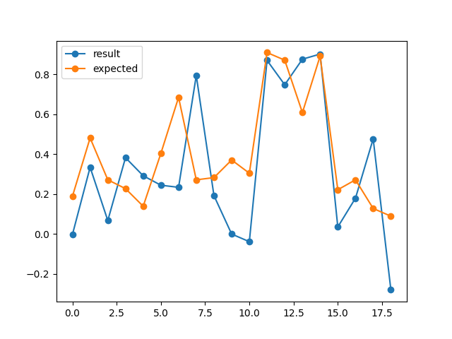

# TPNS2
### Первый скрытый слой имеет 90 нейронов, а второй 60. Количество эпох 1000, коэффициент обучения 0.01. Датасет разделяется, 80% идут на тренировку и 20% на тестирование. Веса обновляются после каждой эпохи, за одну эпоху проходятся все тренировачные данные в случайном порядке 

### После каждой эпохи проводилось тестирование и считалось тестовое mse, ниже приведены графики спада тренировочного и тестового mse, первый график для g total, второй для КГФ. Ось x - номер эпохи, ось y - mse

### G total, на тестовых данных, предсказанные и настоящие значения

### КГФ на тестовых данных, предсказанные и настоящие значения

